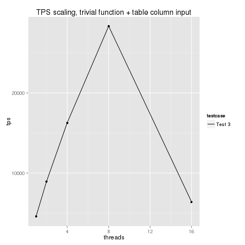

Results
-------

These graphs should hopefully be self-explanatory. 

Observations
------------

- ParTest 0-2 demonstrate that calling into pl/pgsql parallelises pretty well. It's interesting to see the impact of adding 1 local 
variable or an input parameter upon performance.

- ParTest 3/5 demonstrates that as soon you touch a table, your ability to parallelise worsens substantially (n.b. NOT the absolute 
value but rather the scalability the from 1-core value). This includes both a soft-limit (my performance doesn't scale up past a couple 
of cores) plus also a hard-limit (after 8 cores, the performance crashes).

- ParTest 4 and 5 demonstrate that as soon as you start doing 'work' inside your function, parallelisation/core-scalability falls through the floor.

An alternative set of benchmarks I have prepared that find a very similar result (using different hardware and different PG versions) 
can be seen at http://parpsql.com

I hope this is useful and inspires some discussion/thought in the dev community about this problem, assuming the problem is not unique 
to my systems.

