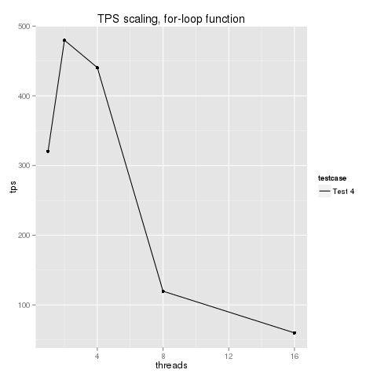
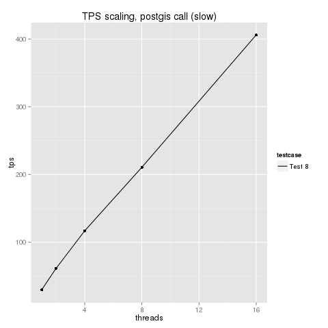
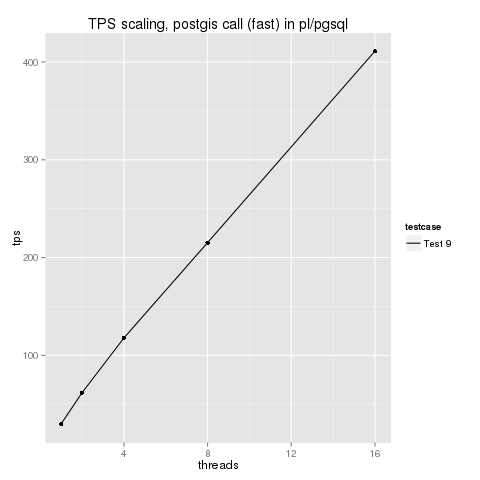

Results
-------

These graphs should hopefully be self-explanatory. 

Observations
------------

- ParTest 0-2 demonstrate that calling into pl/pgsql parallelises pretty well. It's interesting to see the impact of adding 1 local 
variable or an input parameter upon performance.

- ParTest 3/5 demonstrates that as soon you touch a table, your ability to parallelise worsens substantially (n.b. NOT the absolute 
value but rather the scalability the from 1-core value). This includes both a soft-limit (my performance doesn't scale up past a couple 
of cores) plus also a hard-limit (after 8 cores, the performance crashes).

- ParTest 4 and 5 demonstrate that as soon as you start doing 'work' inside your function, parallelisation/core-scalability falls through the floor.

- ParTest 6 shows that e.g. postgres's MD5 function isn't affected.

- ParTest 7-10 show that postgis doesn't seem to be affected and that calling to postgis from inside pl/pgsql isn't affected.

An alternative set of benchmarks I have prepared that find a very similar result (using different hardware and different PG versions) 
can be seen at [the par_psql benchmarks page](https://github.com/gbb/par_psql/blob/master/BENCHMARKS.md).

Notes
-----

From discussion on the postgresql mailing lists, it seems the big problem is caused by internal locks that are taken out when you are 
doing work in pl/pgsql. Each statement takes out a lock, and if you do lots of statements quickly (e.g. for-loop or large set of fixed 
calculations), your chokepoint becomes the lock mechanism at the database level. It could also be that you have a server with lots of 
users doing pl/pgsql work, and then you are sharing the capabilities of the lock system at system-level. 

Solutions proposed
------------------

1) If you just use pl/pgsql as 'glue', calling out to external functions as Tom Lane suggests, you shouldn't see the problem. This means 
that e.g. postgis users probably won't be affected unless they have a tight loop creating geometry or something like that.

2) If you use another pl/ language such as pl/v8, you should not be affected since they don't use the statement-level lock.

3) Tom Lane and others also suggest that if you mark functions with volatility categories (if the function is suitable), it can overcome 
the main problem with statement-level locking, at least as far as 8-cores. [See here](http://www.postgresql.org/docs/current/static/xfunc-volatility.html).

4) There seems to be some interest among developers in possibly improving the way postgres handles functions that don't have volatility 
categories marked, to automatically overcome this problem in the future.

