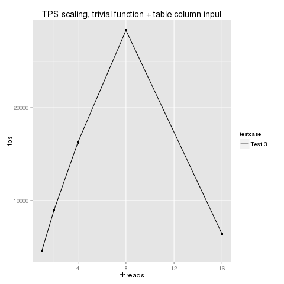
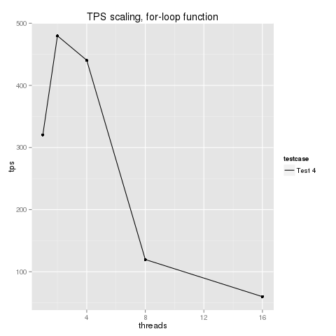

Parallel pl/pgsql performance tests (v1, July 2015)
---------------------------------------------------

Whenever I use pl/pgsql functions I get a maximum of 2 core scalability (PG9.3) and about 
2.5 core scability (PG9.4). Whenever I use a table for input to pl/pgsql (read-only) I 
get approx. 8 core maximum scability. These scaling problems do not affect my ordinary 
SQL or my trivial pl/pgsql functions that don't use tables and don't do much computation.

I believe this benchmark will highlight two significant faults/weaknesses in postgresql's 
abilities to run pl/pgsql functions on parallel cores. Hopefully, it the future it will 
be used to show how amazing postgresql is at scaling up for parallel processing :-)

The situation modelled here is similar to what you face if you are running a GIS server 
with lots of postgis and pl/pgsql code. I have encountered both these problems in real 
world projects when refactoring code.

These graphs should hopefully be somewhat self-explanatory... they show 
what happens when you set the same pl/pgsql task running on multiple cores. In 
this case, the same function and table is used. In my other benchmarks 
(see [parpsql.com](http://parpsql.com) you can see the same problem even when each parallel 
connection uses differently named functions and different/independent tables. 

More graphs and details here: [RESULTS](GRAPHS.md).

Source data and some information about the host are in the 
sample_results folder below.

If others can confirm these problems, it is useful because there's a lot 
of pl/sql and pl/pgsql functions out there in the wild, and people are 
probably buying big servers expecting their code will scale a bit.  In 
my own experience, even when you're using completely independent 
functions and tables, parallelism doesn't happen much where pl/pgsql is 
involved. I first encountered this problem during a project in which a 
simple forest simulation was carried out inside a pgsql function.

This is potentially rather bad news for projects like PostGIS, perhaps 
pgrouting, which depend a lot on pgsql. So, please can you run the 
benchmark and let me know what happens? (there's a thread on 
pgsql-performance mailing list or you can raise comments on github).

This Repo
--------

This repo contains 6 tests currently:

- partest0: A trivial function that returns 1. 
- partest1: The same trivial function as partest0, but also declaring an internal variable.
- partest2: The same trivial function as partest1, but also accepting a numeric input parameter which is fixed as '3'.
- partest3: The same trivial function as partest2, but this time the wrapper passes the parameter as a value read from a table.
- partest4: A for-loop function inside the pl/pgsql environment, with no parameters. 
- partest5: A for-loop function inside the pl/pgsql environment as in partest4, and with a parameter read from a table as in partest3.

These tests are run in series, with pgbench set to use a single connection or many connections/cores in parallel.
The tests are read-only. They do not write any values to any tables (except the pgbench init that is run at the start). 
Please note e.g. partest3,4,5 are not directly comparable, whereas partest 0,1,2 can be compared directly (see results folder).

To run these tests, install pgbench (e.g. yum install postgresql93-contrib), then type

    git clone http://github.com/gbb/ppppt
    cd ppppt
    ./ppppt.sh

The results will be stored into (ppppt_results.txt)
Output from functions is stored in (ppppt_runlog.txt)
If you have R installed, a cute graph will appear in (ppppt_graph.png)

You can also take a look at the included sample results file (ppppt_example_results.txt, ppppt_sample_graph.txt)

Other information
-----------------

- I hope this is useful and inspires some discussion/thought in the dev community about this problem, assuming the problem is not unique 
to my systems.

- Thank you to Merlin Moncure for his comments on pgsql-performance mailing list which motivated me to set this up, particularly the nice tip 
about using pgbench this way.

- Please try to run your tests for at least 60 seconds each. (However, you'll see the same result with t=1...)

- Please include the result header with the CPU and kernel and PG information if you are posting your own benchmarks.

- Note that in my sample results, I have HT enabled on my machines currently because they do more than run as postgresql servers. 
Please be aware this is currently (late 2014) not best practice for scaling past e.g. 30 cores.

- Everyone is welcome to use & modify this code (postgresql license), providing you do not publish my findings as your own results.

- This work is prepared for and being presented at FOSS4G Europe, Italy 2015 (Free Open Source Software for GIS).

- If you're interested in parallel programming please check out parpsql.com  (aka github.com/gbb/par_psql)

Graeme B Bell  (firstnamedotlastname@nibio.no)

NIBIO (previously known as the Norwegian Forest and Landscape Institute)
